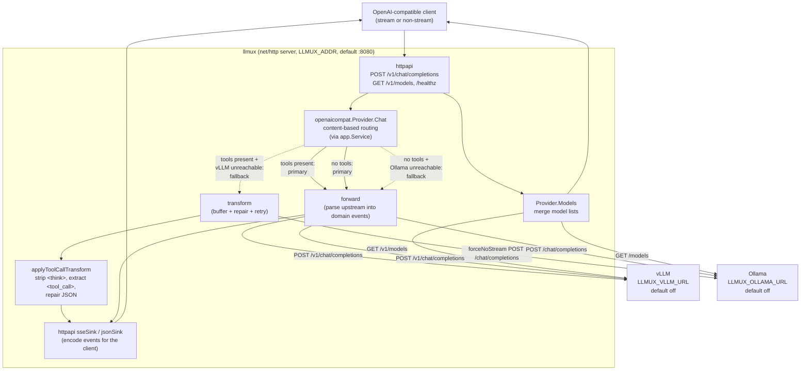

# llmux Architecture Overview

## Purpose & context

`llmux` is a small, single-binary HTTP proxy that sits between an
OpenAI-compatible client (Open Interpreter, Claude Code, aider, etc.) and two
self-hosted inference backends — **vLLM** and **Ollama**. It exposes the subset
of the OpenAI REST surface those clients use and forwards requests to whichever
backend is appropriate, then repairs the response before returning it.

The reason it exists is response quality, not load distribution. Tool-calling
models served by vLLM and Ollama frequently emit *malformed* output that strict
downstream parsers reject:

- `<tool_call>...</tool_call>` XML wrappers instead of the OpenAI `tool_calls`
  array.
- Orphaned or full `<think>...</think>` reasoning blocks left in `content`.
- Tool-call JSON with literal control characters, invalid escape sequences
  (Python regex `\s`, `\d`), or unescaped inner quotes.
- Empty responses when tools are supplied but the model decides no tool is
  needed (a known Qwen3 conversational-query failure mode).

`llmux` normalizes all of this into clean OpenAI-shaped responses. It is
stateless, holds no request-scoped shared mutable state, and depends only on the
Go standard library.

## Component & request-flow diagram

## Package layout (hexagonal, since 2026-09-25)

llmux was a single `main` package until 2026-09-25. It is now split into the
hexagonal layout the other Go repos use, enforced by `go-arch-lint`
(`.go-arch-lint.yml`, copied from golinks):

| Package | Role |
|---|---|
| `internal/domain` | `ChatRequest`, `Event` (Start/Text/ToolCall/Finish/Usage), `EventSink`, errors. Stdlib only. |
| `internal/ports/inbound` | `ChatService` — what the HTTP adapter drives. |
| `internal/ports/outbound` | `ChatProvider` — what a model backend implements. |
| `internal/app` | Routes each request to the first provider whose `Handles(model)` is true. |
| `internal/adapters/httpapi` | Inbound: OpenAI-compatible routes; parses requests, encodes events as SSE or JSON. |
| `internal/adapters/anthropic` | Outbound: Anthropic's native Messages API — text, web search, citations (see below). |
| `internal/adapters/openaicompat` | Outbound: vLLM + Ollama, with the routing, failover and tool-call transform described below. |
| `internal/testdoubles` | Scripted fake `ChatProvider`. |
| `cmd/llmux` | Configuration and wiring. |

Every provider translates its upstream into `domain.Event`s and the inbound
adapter translates events into OpenAI output — so a provider never writes to
the client directly, and a new provider needs no HTTP code.

The flow sections below describe behaviour that is unchanged, but name the
original functions. Where they live now:

| Original (`main.go`) | Now |
|---|---|
| `handleChat` routing + fallback | `openaicompat.Provider.Chat` |
| `proxyStream` (byte passthrough) | `openaicompat.Provider.forward` → `relaySSE` / `emitMessage` (parse, then re-encode) |
| `proxyTransform[Inner]` | `openaicompat.Provider.transform` |
| `writeAsSSE` | `openaicompat.emitMessage` + `httpapi.sseSink` |
| `applyToolCallTransform`, `repair*`, body helpers | `openaicompat/transform.go`, byte-identical |
| `handleModels` / `fetchModels` | `openaicompat.Provider.Models` + `httpapi` `/v1/models` |

⚠️ **One behaviour change:** the streaming path used to relay upstream bytes
verbatim. It now parses each chunk into events and re-encodes them, so fields
llmux doesn't model (`reasoning_content`, `logprobs`, provider extensions) are
dropped from vLLM/Ollama streams.

## Runtime flow, end to end

### Startup & configuration

`cmd/llmux` reads configuration from the environment, builds the providers,
and serves `httpapi.New(app.New(providers...))` with graceful shutdown on
SIGINT/SIGTERM.

| Var | Default | Meaning |
|---|---|---|
| `LLMUX_ADDR` | `:8080` | Listen address / port. |
| `LLMUX_ANTHROPIC_API_KEY` | unset (off) | Enables the Anthropic provider. |
| `LLMUX_ANTHROPIC_MODELS` | `claude-sonnet-5,claude-opus-5,claude-haiku-4-5` | Models routed to Anthropic, and listed by `/v1/models`. |
| `LLMUX_ANTHROPIC_MAX_TOKENS` | `8192` | `max_tokens` when the request sets none (Anthropic requires one). |
| `LLMUX_ANTHROPIC_URL` | `https://api.anthropic.com` | API base URL (tests point it at a fake). |
| `LLMUX_VLLM_URL` | empty (off) | vLLM base URL. Was `http://10.42.2.10:8000` until 2026-09-25. |
| `LLMUX_OLLAMA_URL` | empty (off) | Ollama base URL. Was `http://10.42.2.10:30068/v1` until 2026-09-25. |

Providers are registered Anthropic first, then vLLM/Ollama: `app` routes to
the first provider whose `Handles(model)` is true, and vLLM/Ollama handles
every model. ⚠️ Before 2026-09-25 an empty URL was documented to disable a
backend but did not: the old `getenv` treated `""` as unset. `envOr` now uses
`os.LookupEnv`. With no backend configured llmux still starts and `GET /healthz` returns 200 — the planned
homelab deployment (homelab#1471) uses it as its readiness probe.

Routes: `POST /v1/chat/completions`, `GET /v1/models`, `GET /healthz`.
Logging is `slog` text to stderr at debug level. No metrics endpoint.

The vLLM/Ollama provider uses one `http.Client` with a **120s timeout**.

### Routing / selection decision

Routing is **content-based with connection failover** — not round-robin, not
per-model, not weighted. `handleChat` reads the full request body, then branches
on whether the request declares tools (`hasTools`):

- **Tools present** → primary is **vLLM** (`proxyStream` to
  `vLLM_URL + /v1/chat/completions`), because vLLM handles tools natively. If
  vLLM is unreachable, fall back to **Ollama** via `proxyTransform`
  (`ollamaURL + /chat/completions`) with the body rewritten to `stream:false`
  (`forceNoStream`) so the response can be buffered and repaired.
- **No tools** → primary is **Ollama** (`proxyStream` to
  `ollamaURL + /chat/completions`). If Ollama is unreachable, fall back to
  **vLLM** (`proxyStream` to `vLLM_URL + /v1/chat/completions`).

"Unreachable" specifically means a connection/transport error from
`httpClient.Do` — `proxyStream` returns `false` only in that case, which is the
signal to try the fallback. A non-2xx HTTP status from a *reachable* backend is
streamed straight through to the client (status and headers copied), not treated
as failover.

### Upstream call & response handling

Two response paths exist:

1. **`proxyStream` (passthrough / streaming)** — copies `Content-Type`,
   `Authorization`, and `Accept` request headers upstream, then copies all
   response headers and status back, and streams the body in 4 KB chunks calling
   `http.Flusher.Flush()` after each write. This preserves native
   server-sent-events (SSE) token streaming with minimal latency. Used for the
   vLLM-with-tools primary and both no-tools paths.

2. **`proxyTransform` / `proxyTransformInner` (buffer + repair)** — used for the
   Ollama-with-tools fallback. It forces `stream:false` upstream, reads the full
   response, and runs `applyToolCallTransform`:
   - Strips `<think>...</think>` blocks (and orphan `</think>` tags) from
     `content` via `reThink`.
   - Extracts `<tool_call>...</tool_call>` JSON via `reToolCall` and converts it
     to a proper OpenAI `tool_calls` array with generated `call_<hex><idx>` IDs,
     sets `content` to `null`, and sets `finish_reason: "tool_calls"`.
   - Repairs malformed tool-call JSON in up to three passes:
     `repairJSONStrings` (escape control chars / invalid escapes), then
     `repairUnescapedQuotes` (uses `json.SyntaxError.Offset` to find and escape
     premature string-terminating quotes, up to 20 iterations). A
     `json.Decoder` is used so trailing garbage after a valid object is ignored.
   - If every tool-call parse fails, the choice is left effectively unchanged;
     the transform is designed to return the original bytes rather than corrupt
     them.

   After transforming, if the client's *original* request asked for streaming
   (`requestedStream(originalBody)`), the buffered JSON is re-emitted as SSE
   chunks by `writeAsSSE` (role delta first, then content or per-tool-call
   name/arguments deltas, then a `finish_reason` chunk and `data: [DONE]`).
   Otherwise the transformed JSON is written directly with
   `Content-Type: application/json`.

### Empty-response retry (a form of failover)

Ollama sometimes returns empty content when tools are present but unnecessary.
`proxyTransformInner` detects this with `isEmptyNonToolResponse` and, guarded to
run **at most once** (`isRetry`), retries the same backend with tools stripped
(`stripTools`) so the model answers conversationally. It refuses this retry when
the conversation already contains `role:"tool"` messages
(`hasToolResultMessages`), because stripping tools from a history that already
dispatched them produces a mangled context that makes the model hallucinate
partial `<tool_call>` fragments.

### `/v1/models`

`handleModels` fans out `GET` requests to both backends
(`vLLM_URL + /v1/models` and `ollamaURL + /models`) via `fetchModels`, and
merges their `data` arrays into a single `{"object":"list","data":[...]}`
response. A backend that errors simply contributes nothing (logged at warn) —
the endpoint degrades gracefully rather than failing.

### Anthropic provider

`internal/adapters/anthropic` calls `POST /v1/messages` directly rather than
Anthropic's OpenAI-compatible endpoint, because only the native API offers
server tools; the compat endpoint silently ignores `web_search_options`.

- **Web search:** every request offers the model
  `{"type":"web_search_20250305","name":"web_search","max_uses":N}` with N
  from `LLMUX_WEB_SEARCH_MAX_USES` (default 3, 0 = off). Anthropic runs the
  searches; the model decides whether to use them. Measured: a searched
  answer costs ~11–30k input tokens, against tens for an unsearched one.
  `max_uses` is probably per request, so a resumed answer could search more
  than N times (unverified). Open WebUI's background calls (titles, tags,
  follow-ups) use the same model and so are offered the tool too.
- **Citations:** each `citations_delta` of type
  `web_search_result_location` becomes a `domain.EventCitation`, once per URL
  per answer. `httpapi` encodes it as
  `delta.annotations[{type:"url_citation",url_citation:{url,title}}]` (or
  `message.annotations` for JSON). Open WebUI (v0.11.x) renders streamed
  annotations as source chips; its non-streaming path ignores them.
  Search is never surfaced as `tool_calls`: Open WebUI would try to execute
  them.
- **`pause_turn`:** a long server-tool turn can pause. The adapter keeps
  every content block of the turn as the API sent it (text with citations,
  thinking with signature, `server_tool_use` with its input rebuilt from
  `input_json_delta`, `web_search_tool_result` with its encrypted content),
  appends them as an assistant message, and re-requests — up to 3 times —
  streaming on into the same response with one Start, one Finish and summed
  usage. Each resume's `max_tokens` is what the client's budget has left.
  If it is still paused after the cap, the budget is spent, or a block got a
  delta type llmux can't replay, the answer ends with `finish_reason:
  length`. A failed resume keeps the upstream error: a JSON client gets its
  status and `Retry-After`; a streaming one, already answered, an error
  chunk.

- **Request:** `system`/`developer` messages are hoisted into `system`;
  `max_tokens` defaults to `LLMUX_ANTHROPIC_MAX_TOKENS`; whitespace-only stop
  sequences are filtered; `temperature`/`top_p` are always dropped (the Claude
  5 family returns 400 for either). Client tools, tool history, empty user
  messages and non-text parts are rejected with a 400 instead of being
  dropped, so a model never answers as though they were absent.
- **Response:** the upstream call always streams. `parseTurn` relays text
  blocks and citations; thinking and server-tool blocks are dropped and
  nothing is ever emitted as a tool call, since Open WebUI executes tool
  calls it receives. `stop_reason` maps to `finish_reason` (`max_tokens`, or
  `pause_turn` past the resume cap → `length`; `refusal` → `content_filter`;
  else `stop`). Prompt tokens are input plus
  cache creation plus cache read, taken from `message_delta` (cumulative)
  when it carries them. A stream that ends before `message_stop` is an error.
- **Errors:** a non-2xx is relayed with its body and status, except that
  3xx and 401/403 become 502 (llmux's configuration, not the client's) and
  Anthropic's 529 becomes 503; `Retry-After` is passed through. An `error`
  event before `message_start` gets the matching status (overloaded → 503,
  rate limit → 429); after it, a streaming client gets an error chunk and a
  non-streaming one a 502. A connection failure is a 502.
- **Prefill:** a conversation ending in an assistant turn (Open WebUI's
  "continue response") is sent as a prefill with trailing whitespace trimmed
  (Haiku 4.5 400s on it). The Claude 5 family rejects prefill outright; that
  400 is relayed, and its message says why.
- **Timeouts and redirects:** no overall client timeout (answers stream as
  long as they take). Dial 10s, response headers 60s, and any single read of
  the body — error bodies included — waiting over 90s cancels the request
  (Anthropic pings while it works). Time spent writing to a slow client does
  not count. Redirects are
  never followed: Go strips `Authorization` on a cross-host redirect but not
  `x-api-key`.
- **`max_tokens`:** the 8192 default includes thinking tokens, which the
  Claude 5 models spend by default; raise `LLMUX_ANTHROPIC_MAX_TOKENS` if
  long answers end with `finish_reason: length`.

## External integrations & dependencies

**Backends (from code defaults):**

| Backend | Default URL | Role | Endpoints used |
|---|---|---|---|
| vLLM | `http://10.42.2.10:8000` | Primary for tool requests; fallback for plain chat | `/v1/chat/completions`, `/v1/models` |
| Ollama | `http://10.42.2.10:30068/v1` | Primary for plain chat; fallback for tool requests | `/chat/completions`, `/models` |

Both are OpenAI-compatible servers on the homelab LAN (the `10.42.x.x`
Cilium/Talos cluster range). Models are described generically as whatever those
backends serve; `llmux` neither hardcodes model IDs nor prices — it forwards the
client's requested model untouched.

**Go module dependencies:** none beyond the standard library. `go.mod` declares
`module github.com/gjcourt/llmux`, `go 1.24`, and no `require` block. The proxy
uses only `net/http`, `encoding/json`, `regexp`, `log/slog`, `crypto/rand`, and
friends. There is no `go.sum`.

## Key design decisions

- **Content-based routing, not load balancing.** The split (vLLM for tools,
  Ollama for plain chat) reflects each backend's strengths: vLLM's native tool
  handling vs. Ollama's local-model convenience. Failover is purely
  connection-driven.
- **Repair, don't reject.** Every transform stage is defensive: nil/empty input
  never panics, and on any parse failure the original bytes are returned
  unchanged. Invariants documented in `AGENTS.md` require each stage to
  round-trip a clean response byte-for-byte.
- **Pure, I/O-free transform stages.** Transforms take bytes in and return bytes
  out with no globals and no upstream calls, which makes them unit-testable
  (`internal/adapters/openaicompat/transform_test.go`) and safe under
  concurrent, request-scoped handling.
- **Buffer only when necessary.** The happy paths stream through untouched;
  buffering (`forceNoStream`) is reserved for the one path that must rewrite the
  body (Ollama tool transform), and streaming semantics are reconstructed
  afterward by the inbound adapter's SSE sink, so clients that set
  `stream:true` still get SSE.
- **Hexagonal layout.** `internal/domain` holds the provider-neutral request and
  event types; `internal/ports` the inbound `ChatService` and outbound
  `ChatProvider` interfaces; `internal/app` routes a request to the first
  provider that handles its model; `internal/adapters` holds the HTTP API and
  the backends; `cmd/llmux` wires them. It was a single `main.go` until
  2026-09-25 and was split so a second backend (Anthropic) could be added as
  its own outbound adapter.
- **Config by env, fail open on fan-out.** Backends are swappable via env vars,
  empty disables a backend, and `/v1/models` tolerates a down backend.

## Deployment

- **Container image:** there is **no `Dockerfile`** in the repo, so no `ghcr.io`
  image is built or published for `llmux` today. It is built with
  `go build -o llmux ./cmd/llmux` (the `./llmux` binary is never committed).
- **Homelab pin:** none yet. A deployment is planned in homelab#1471 (draft);
  until it merges llmux is **not deployed via the homelab GitOps/Flux tree**.
- **Shutdown:** on SIGTERM the server stops accepting connections and drains
  in-flight requests for up to 25s (under Kubernetes' default 30s grace)
  before exiting.
- **CI:** `.github/workflows/ci.yml` runs build, `go test -race`, gofmt check,
  `go vet`, `golangci-lint` (v2), `go mod tidy` verification, and the
  architecture guard on pushes/PRs to `master`.

### Architecture guard (go-arch-lint)

Added 2026-09-25 with the hexagonal split — the condition this section used to
say would make it worth revisiting. `.go-arch-lint.yml` is golinks' config
unchanged. Note that it allows `adapters → app`: `go-arch-lint`'s deep scan
follows dependency injection, and `cmd/llmux` injects an `app.Service` into
`httpapi.New`, so the inbound adapter is driven by `app` at runtime. Removing
`app` from the adapters' allowed list makes the guard fail on that line.
